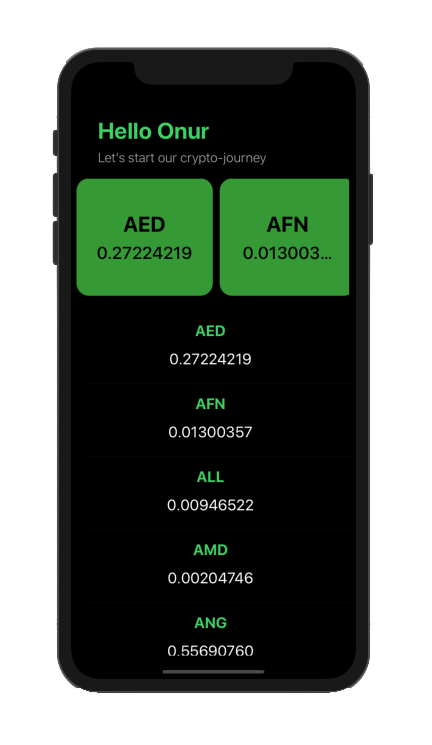
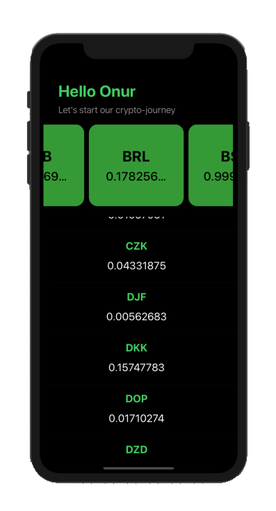
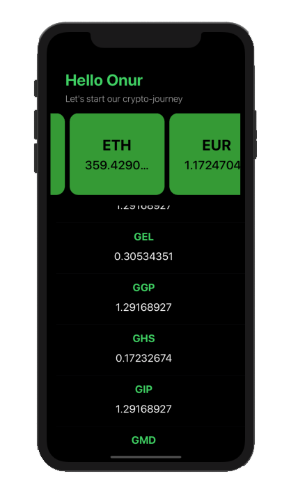

# CryptoCurrencies
<h4> <b>CryptoCurrencies</b> is an application to check the currencies. (MVVM -  API) </h4>
<a href="https://twitter.com/onur_ustunel"> for contact : twitter.com/onur_ustunel </a>

